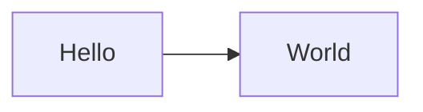
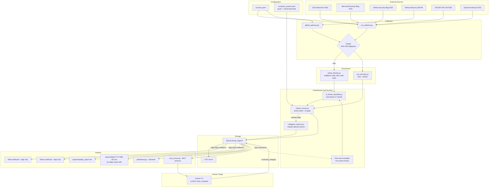
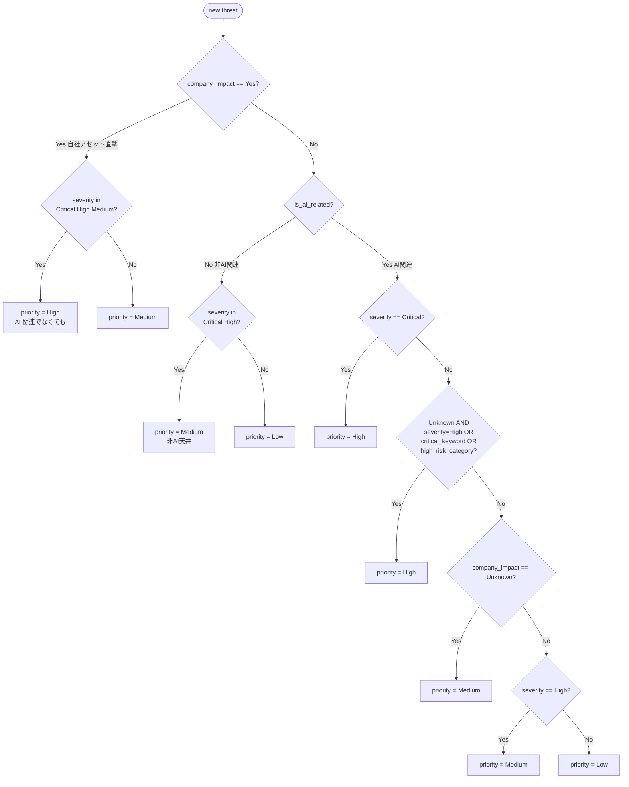
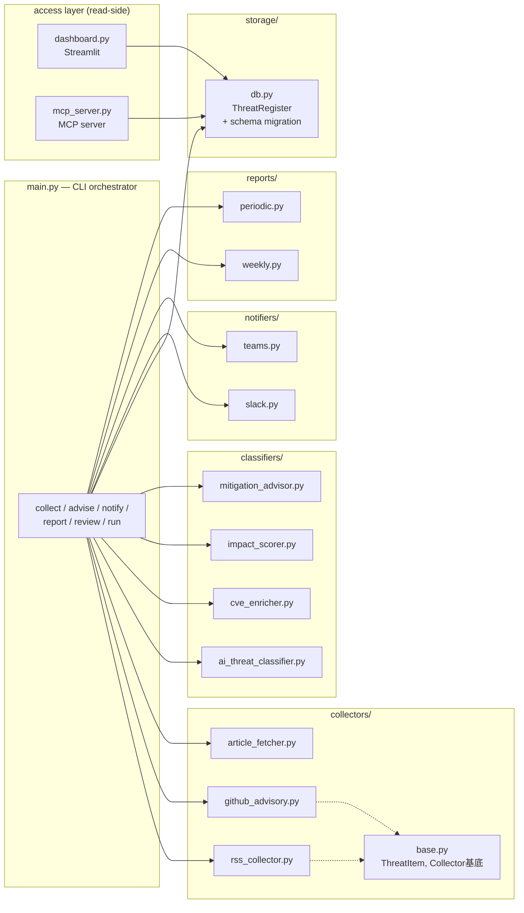

# AI Threat Watch — アーキテクチャ図

GitHub / VS Code (Markdown Preview Enhanced 等) で mermaid ブロックがそのまま描画される。 静的画像が欲しい場合は `mmdc -i docs/architecture.md -o docs/architecture.svg` 等で書き出す。

## 0. Smoke test (動作確認用)

## 1. データフロー全体図

## 2. 優先度判定ロジック (impact_scorer の核)

> 「**AI 関連を必須条件にしつつ、自社アセット直撃は例外として High を維持**」 の流れ

KEV-listed (`in_kev=1`) または EPSS ≥ 0.7 は **テキスト由来の critical_keyword と同等扱い** で D 分岐の `critical_keyword` 側に合流する。

## 3. モジュール責任分担

## 4. CLI コマンドの動作対応

| コマンド | 動作 |
|---|---|
| `python main.py collect` | 収集 → 重複排除 → エンリッチ → 分類 → 影響判定 → 保存 |
| `python main.py advise` | priority=High かつ `tailored_action` 未生成のものに Claude で対策生成 |
| `python main.py notify` | priority=High かつ notified=0 を Slack / Teams に送信 |
| `python main.py report --days 7` | `reports/weekly_report.md` 生成 |
| `python main.py review <id>` | 人間レビュー結果を記録 (→ Few-shot 学習データへ) |
| `python main.py run` | 上記を一括 (collect → advise → notify → report) |
| `python main.py alerts --kev-due-within 7` | KEV 期限切迫アイテム表示 |
| `python main.py stats` | レジスタ統計 |
| `streamlit run dashboard.py` | Web ダッシュボード |
| `python mcp_server.py` (auto via `.mcp.json`) | MCP サーバ (Claude CLI / Desktop から `query_threats` 等を提供) |

## 5. 関連ドキュメント

- [CLAUDE.md](../CLAUDE.md) — プロジェクト全体の設計思想 / 運用ルール (ASCII 図はこちらにある)
- [README.md](../README.md) — セットアップ / コマンド一覧 / カスタマイズ手順
- [docs/design/post-mythos.md](design/post-mythos.md) — Mythos 世界線でこの図をどう延伸するかの設計メモ
