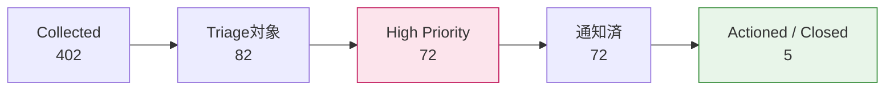
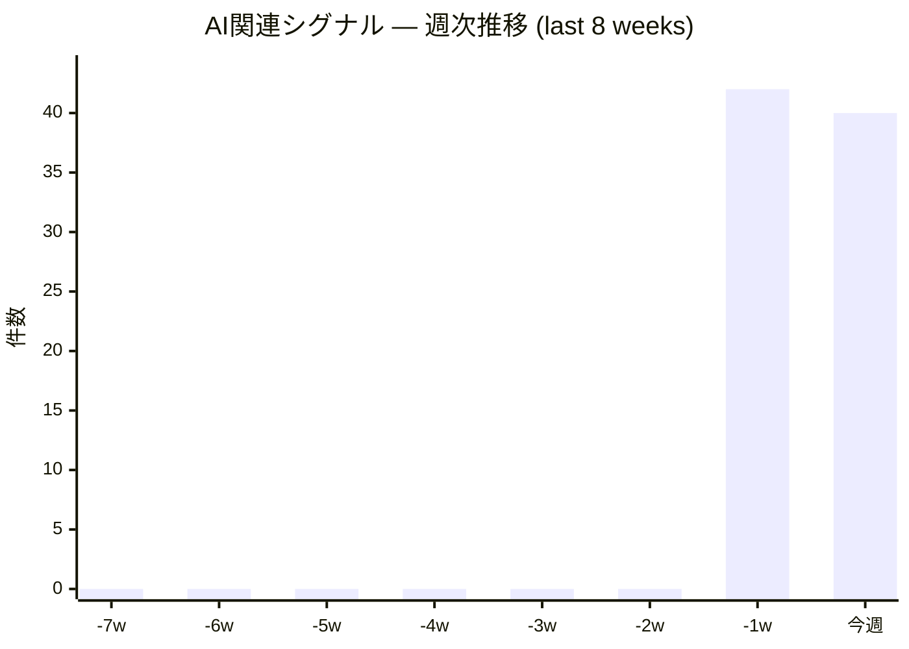
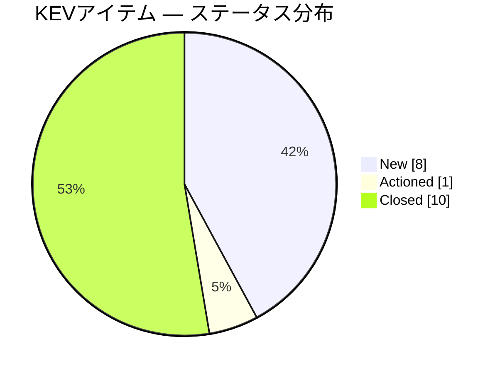
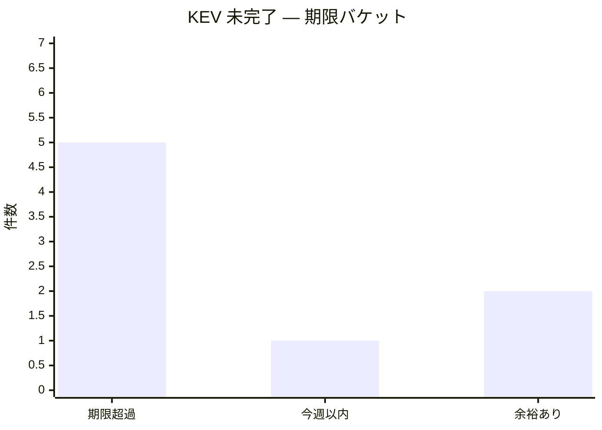
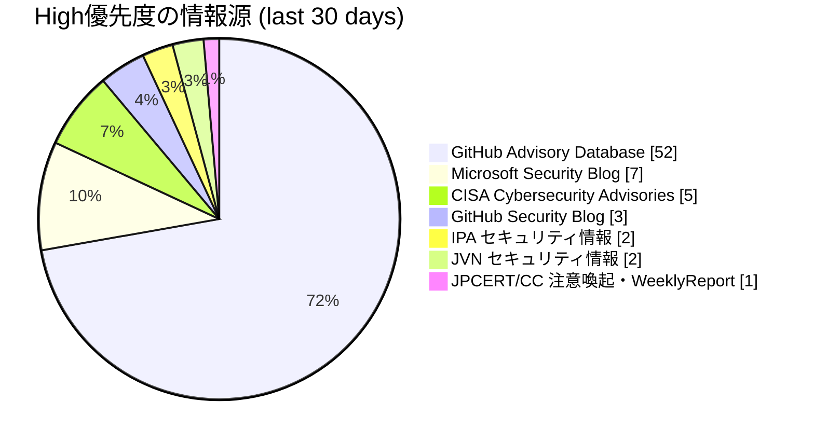

# AI Threat Watch — Dashboard

_Generated: 2026-05-25T22:37:58+00:00 · データソース: `data/threat_register.sqlite`_

GitHub 上で Mermaid 図はそのままレンダリングされます。再生成は `python main.py dashboard`。

---

## 1. Triage ファネル — ノイズ削減ゲートの効き (last 30 days)

直近 30 日に収集した全アイテムが、どのゲートで何件まで絞り込まれたか。
AI 関連シグナルを持たない一般的脆弱性は Medium 以下に降格される設計のため、
High に残るのは Triage 対象として in-scope と判定されたアイテムのみ。

**読み方**: `Collected → Triage対象` の絞り込みがノイズ排除の主役。
`High → 通知済 → Actioned/Closed` の右肩下がりが運用追従度を表す。
通知済より Actioned/Closed が極端に少なければトリアージが詰まっているサイン。

---

## 2. AI 関連シグナル — 週次トレンド (last 8 weeks)

Triage 対象 (in-scope) と判定された AI 関連シグナル件数の週次推移。
急増があればカテゴリ内訳表で当たりをつける。

### 直近 8 週のカテゴリ内訳 (Top 5)

| Category | Count (last 8w) |
|---|---:|
| AI Supply Chain | 21 |
| Tool Poisoning / MCP Risk | 19 |
| AI-generated Code Vulnerability | 12 |
| Sensitive Information Disclosure | 6 |
| Agent Excessive Agency | 4 |

---

## 3. KEV (Known Exploited Vulnerabilities) 対応リードタイム

KEV-listed の脆弱性は CISA が修正期限を設定しているため、期限超過は SLA 違反として扱う。

### ステータス分布 (全 KEV 蓄積)

### 未完了 KEV — 期限バケット

- **期限超過**: 5 件 — 即時対応 (SLA 違反)
- **今週以内**: 1 件 — 7 日以内に期限到来
- **余裕あり**: 2 件 — 7 日以上先

---

## 4. ソース別貢献度 — High 優先度はどこから来るか (last 30 days)

直近 30 日に High 判定された脅威の情報源分布。
寄与の低いソースは打ち切り候補、寄与の高いソースは継続強化対象。

---

_本ダッシュボードは `reports/dashboard.py` が生成。詳細は
[週次レポート](../reports/weekly_report.md) と
[日次レポート](../reports/daily/) を参照。_
